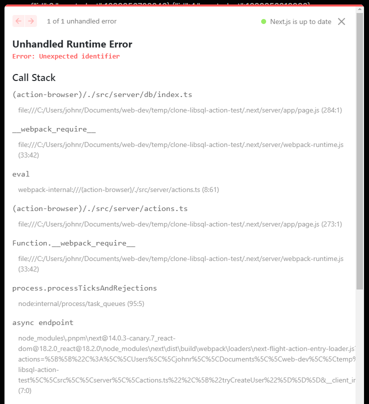
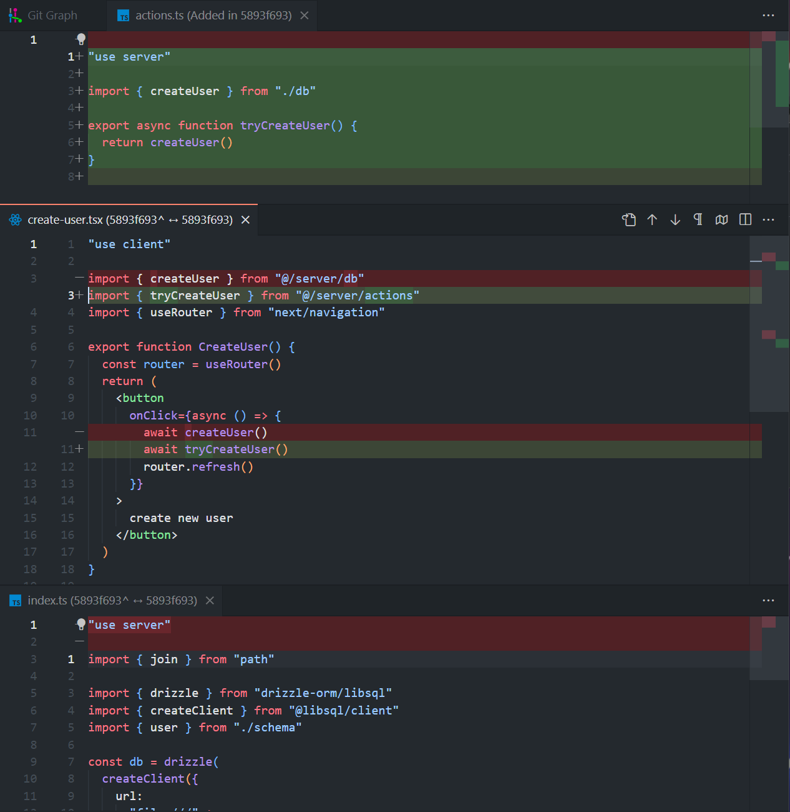

# Server Action Error with latest canary release

The most annoying part of this error is the fact that everything works before I add an `actions.ts` file with `"use server"` and import functions from another file.

## Getting started

Install deps, run app, visit `http://localhost:3000`, and click the "create user" button.

```
pnpm i
pnpm dev
```

## The error



## Changes that caused this error

I moved from `@/server/db/index.ts` having the `"use server"` directive, to creating an `@/server/actions.ts` file with the `"use server"` directive. This caused error seen above.


